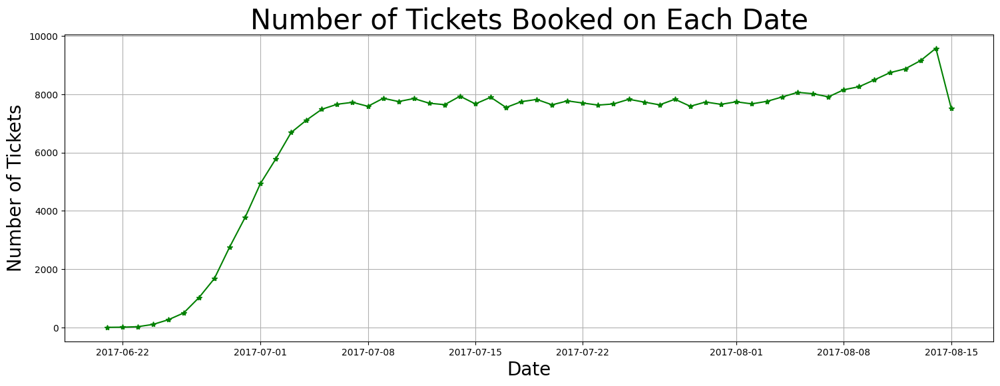
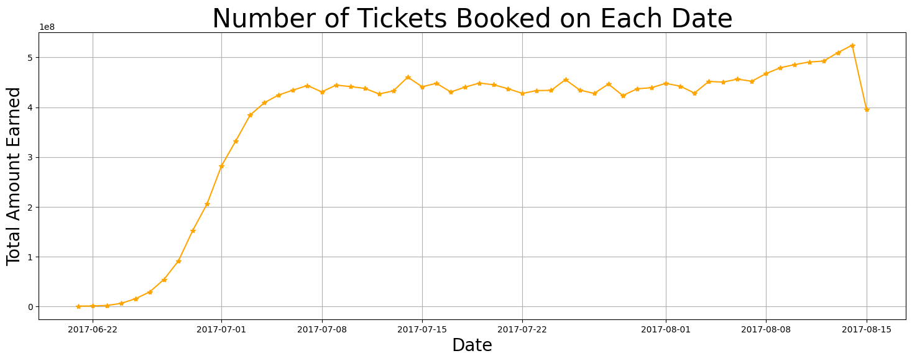
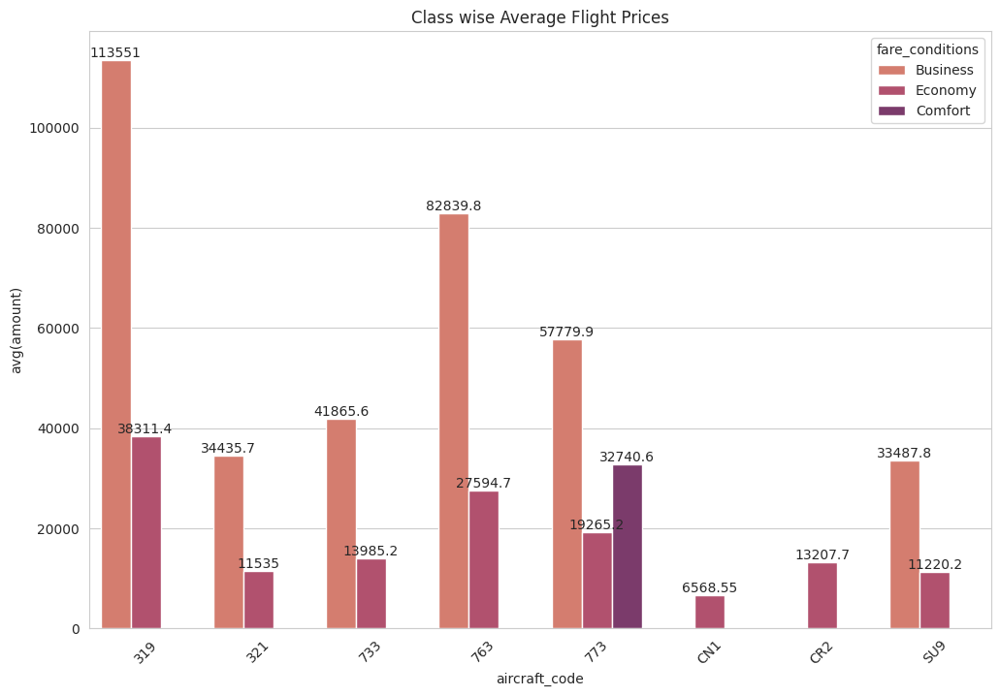
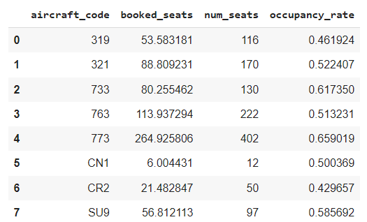
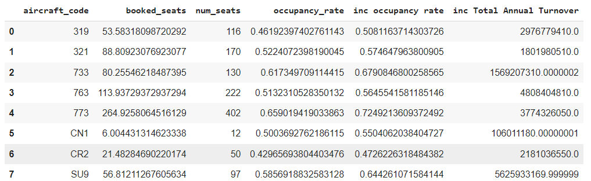
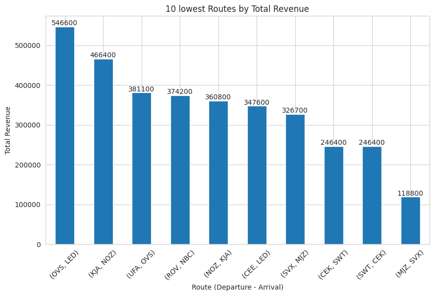
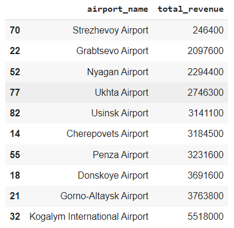

# Airline Occupancy Analysis Project

[Check out the full report here](https://github.com/Shaikh-Umar-Farooq/Data-analysis---Airlines/blob/main/AIRLINE%20OCCUPANCY-report.pdf)

## Table of Contents

1. [Business Problem](#business-problem)
2. [Main Challenges](#main-challenges)
3. [Objectives](#objectives)
4. [Basic Analysis](#basic-analysis)
5. [Analyzing Occupancy Rate](#analyzing-occupancy-rate)
6. [Analyzing Other Factors for Profitability](#analyzing-other-factors-for-profitability)
7. [Suggestions](#suggestions)

---

## Business Problem

Our company operates a diverse fleet of aircraft ranging from small business jets to medium-sized machines. Despite providing high-quality air transportation services for several years, we face challenges due to:

- Stricter environmental regulations
- Higher flight taxes
- Increased interest rates
- Rising fuel prices
- Tight labor market resulting in higher labor costs

These factors put pressure on our profitability. Therefore, we aim to analyze our databases to find ways to increase the occupancy rate, boosting the average profit per seat.

## Main Challenges

1. **Stricter Environmental Regulations**: Increased operating costs and restricted expansion potential due to more stringent environmental laws.
2. **Higher Flight Taxes**: Governments impose heavier taxes to solve environmental issues and increase revenue, raising the cost of flying and decreasing demand.
3. **Tight Labor Market**: The aviation sector's shortage of trained personnel increases labor costs and turnover rates.

## Objectives

1. **Increase Occupancy Rate**: Boost the average profit earned per seat.
2. **Improve Pricing Strategy**: Develop a strategy considering changing market conditions and customer preferences.
3. **Enhance Customer Experience**: Provide a seamless and convenient experience from booking to arrival to increase customer loyalty.

The ultimate goal is to identify opportunities to increase the occupancy rate on low-performing flights, leading to increased profitability.

## Basic Analysis

We conducted a basic analysis to gain insights into our operations:

- **Number of planes with more than 100 seats**:

| Aircraft Code | Num Seats |
|---------------|------------|
| 319           | 116        |
| 320           | 140        |
| 321           | 170        |
| 733           | 130        |
| 763           | 222        |
| 773           | 402        |

### Ticket Bookings and Revenue Trend

We observed the following from our line chart visualization:

- Gradual increase in ticket bookings from June 3rd to July 7th.
- Stable pattern from July 8th until August.
- Noticeable peak in ticket bookings and revenue on certain days.

**Images**:  
  
*Fig 1: Trend of Ticket Bookings on each date* 

  
*Fig 2: Trend of Ticket Bookings and Revenue Earned* 

### Fare Conditions Comparison

We generated a bar graph comparing the average cost associated with different fare conditions for each aircraft.

**Images**:  
  
*Fig 3: Average Cost for Different Fare Conditions*

## Analyzing Occupancy Rate

### Total Revenue, Total Tickets, and Average Revenue per Ticket

**Images**:  
  
*Fig 4: Total Revenue, Total Tickets, and Average Revenue per Ticket for Each Aircraft*

### Average Occupancy per Aircraft

**Images**:  
  
*Fig 5: Average Booked Seats vs. Total Number of Seats*

### Impact of 10% Increase in Occupancy Rate

**Images**:  
  
*Fig 6: Total Revenue Increase with 10% Higher Occupancy Rate*

## Analyzing Other Factors for Profitability

### Low Revenue Generating Airports

**Images**:  
  
*Fig 7: 10 Lowest Revenue Generating Airports*

### Low Revenue Generating Routes

**Images**:  
  
*Fig 8: 10 Lowest Revenue Generating Routes*

## Suggestions

1. **Implement Dynamic Pricing**: Adjust ticket prices based on real-time demand, competition, and booking trends.
2. **Route Diversification**: Explore alternative routes or add stopovers to increase passenger traffic.
3. **Target Low Revenue Airports**: Focus marketing and promotional efforts on underperforming airports or reduce services to reallocate resources effectively.
4. **Tailored Marketing Campaigns**: Use passenger demographic insights to create targeted marketing campaigns.
5. **Offer Promotions and Discounts**: Introduce promotions and discounts during off-peak seasons to attract more passengers.

---

This project aims to provide a comprehensive analysis and actionable insights to enhance our airline's occupancy rate and overall profitability. For further details, refer to the full report.
